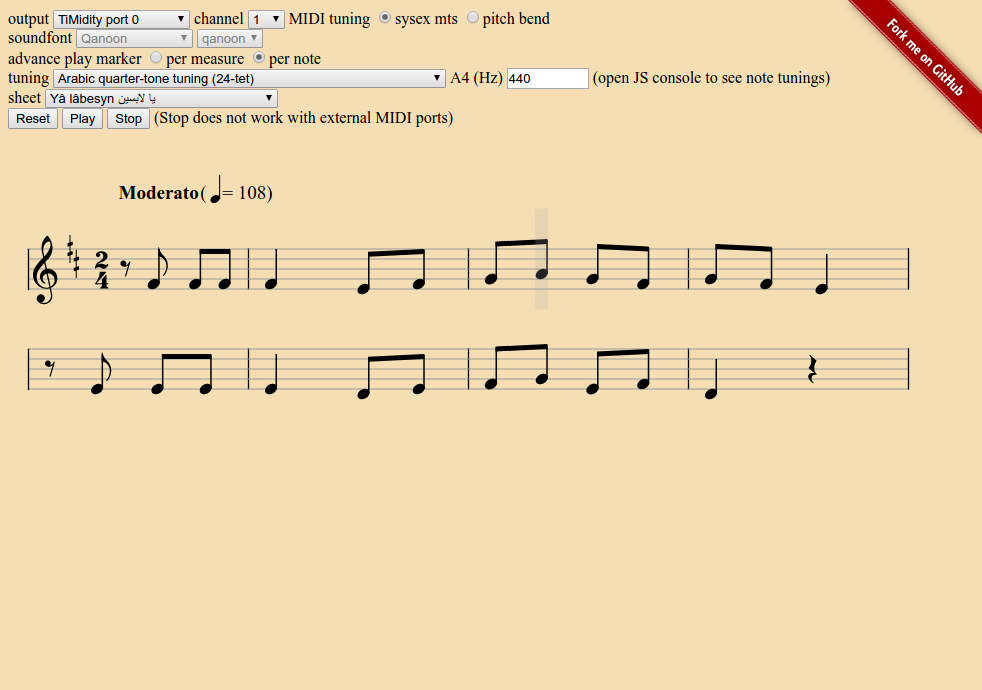

# Sheet Player

## What is this?

A demo of music localization in action. The sheet player supports the following features:
- MIDI output or local sounds synthesis
- Microtonal tunings including ability to replay piece in a different tuning
- Microtonal key signatures

[CHECK OUT THE DEMO!](https://ethereum.karimratib.me:8080/)



## Getting started
- `git clone git@github.com:infojunkie/music-l10n.git && cd music-l10n/experiments/sheet-player/`
- Start a local HTTP server, e.g. `npm install -g http-server && http-server -c0`
- Open [http://localhost:8080](http://localhost:8080)
- Select the sheet called "Bach Minuet in G"
- Play!
- `npm install`
- `webpack --watch`

## MIDI / Web MIDI setup
My OS setup:
- Ubuntu 16.04 x86_64 kernel `4.4.0-XX-lowlatency` GNU/Linux
- Google Chrome from repo `http://dl.google.com/linux/chrome/deb stable/main`
- Mozilla Firefox from `http://ca.archive.ubuntu.com/ubuntu xenial-updates/main`

My MIDI setup:
- Install MIDI synth TiMidity - [Ubuntu has it](https://help.ubuntu.com/community/Midi/SoftwareSynthesisHowTo)
- `timidity -iAD` to start TiMidity in ALSA sequencer daemon mode
- `aconnect -o` should show available MIDI output ports and their client numbers, including `TiMidity` and `Midi Through`
- Firefox does not support Web MIDI natively. To add support, you need to install [Jazz-Plugin](http://jazz-soft.net/download/Jazz-Plugin/)
  - `sudo modprobe snd-virmidi` to enable Virtual MIDI ports (needed by Jazz-Plugin)
  - try `aconnect -o` again and note new `Virtual Raw MIDI` ports
  - `aconnect 24:0 130:0` where `24:0` should be the client:port of `VirMIDI 2-0` and `130:0` should be the client:port of `TiMidity port 0`
  - check that [Jazz-Plugin is able to find your MIDI ports](http://jazz-soft.net/demo/Connected.html)
- In the Sheet Player app, select the output MIDI port to be `TiMidity port 0` (or `VirMIDI 2-0` in the case of Jazz-Plugin)
- Play!

## Local sound synthesis
Basic playback is implemented using a [local synth that accepts MIDI messages](https://github.com/danigb/soundfont-player).

This library is cool because it plays [soundfonts](https://en.wikipedia.org/wiki/SoundFont), which are a format to exchange instrument samples commonly used by various MIDI synths. The sheet player comes preloaded with 3 sondfonts, the last of which, **Qanoon**, is an example of a locally-generated one.

To generate a local soundfont, you need to run `../soundfont-generator/soundfont-generator.rb` which takes a standard `.sf2` file and outputs a compatible sample structure that the local synth player can load. Then edit `soundfonts.json` to include your soundfont in the dropdown.

## Music engraving and score definition
Sheet music display is implemented using [VexFlow](https://github.com/0xfe/vexflow).

Since VexFlow contains a full specification of the performance, it can be parsed to generate MIDI events. This is what the function `playVexFlow` does. It's a tricky function to write because each part of the VexFlow model can potentially affect MIDI playback. For example:

- Key signature
- Grace notes
- Dynamics
- Repeats and voltas
- Ties
etc.

## Tuning and microtonal support
The app supports multiple tunings, allowing to play music from different cultures. For example, contemporary Arabic music uses a quarter-tone system based on equal temperament of 24 microtones (12 of which align precisely with the standard Western equal temperament).

A "tuning" defines a sequence of tones and calculates the ratio of each tone with respect to a given reference tone. Note names are supplied to index specific tones in the sequence, and accidentals refer to index increments in the sequence of tones. In the Arabic 24-tet example, note C is defined as the first tone, note D as the 4th tone, note E as the 8th, etc. This is different from a 12-tet tuning where D is defined as the 2nd tone, E as the 4th, etc. This definition allows songs to be played in different tunings, provided the note names and accidentals supplied to each tuning correspond to the original song notation. In most cases, English note names (C, D, E, F, G, A, B) and standard accidentals are used.

The ratio returned by a tuning for a given note is then multiplied by the reference frequency (e.g. A440) to obtain an absolute frequency to be played. This frequency is then converted to a MIDI key, including a "detuning" factor when the tuning deviates from MIDI's internal 12-tet tuning.

To support microtonal music during MIDI playback, two approaches are implemented:

- Using [MIDI Pitch Bend messages](http://sites.uci.edu/camp2014/2014/04/30/managing-midi-pitchbend-messages/). Pitch bend affects a full MIDI channel, so all notes that are playing on that channel while the bend is in effect will be affected. Also, because this message is separate from the Note On and Note Off messages, one can sometimes hear sound fluctuations at note boundaries.

- Using [MIDI Tuning "SysEx" message](http://www.microtonal-synthesis.com/MIDItuning.html). It is possible to send a tuning specification for each MIDI note ahead of time, but not all MIDI synths support this feature.

## MIDI playback issues
The Web MIDI API allows to schedule MIDI events "in advance", i.e. by allowing for each event a future timestamp or time difference to wait for before sending the event to the specified port. This is useful because browser tabs that are unfocused throttle the `setTimeout` family of functions, which makes real-time scheduling of events unreliable. [Timers based on Web Workers](https://github.com/chrisguttandin/worker-timers) should solve this but a [regression on Chromium breaks this functionality](https://bugs.chromium.org/p/chromium/issues/detail?id=642321) at the moment.

HOWEVER! What happens when the user wants to stop playback before the song is over? The Web MIDI API specifies a `Output.clear()` method which should clear this queue of future MIDI events, but [Chrome does not implement it yet](https://bugs.chromium.org/p/chromium/issues/detail?id=471798). I still haven't found a workaround for that.

## Experiment: using MIDI Through Ports to route output to softsynth
Routing the MIDI output of the sheet player to a softsynth such as a [Yamaha DX7 emulator](http://mmontag.github.io/dx7-synth-js/).
The `MIDI Through Port` ports appear both as input and output, and indeed they show up
both on the sheet player's output MIDI ports, and on the DX7 emulator's input ports.

- Open the Sheet Player app and select `MIDI Through Port-0` as output
- Open the Yamaha DX7 emulator in another tab and select `MIDI Through Port-0` as MIDI Device (which is the synth's input)
- Play!
- Change instruments on the DX7
- Play again!
- Try the same with [Reason's Europa](https://www.propellerheads.se/europa)!

## Various notes
- To increase the number of available MIDI Through Ports, edit `/etc/modprobe.conf/alsa-base.conf` to add the following line:
```
options snd-seq-dummy ports=4
```
- Virtual MIDI Ports (provided by kernel module `snd-virmidi`) are NOT used for general routing of MIDI messages! cf. http://music.stackexchange.com/questions/51463/how-to-use-snd-virmidi-on-linux
- Jazz-Plugin on Firefox seems to return ONLY Virtual MIDI Ports, NOT the full list of ALSA MIDI ports. Investigating: http://jazz-soft.org/bb/viewtopic.php?f=2&t=934
- MacOS X users can [also create virtual MIDI ports](https://www.skratchdot.com/2016/01/creating-virtual-midi-ports-on-osx/)

## TODO

### Model
- Library of scales in any key
- Add metronome track
- Add percussion track
- Support playback with auto-generated accompaniment

### MIDI
- Add options to output to Web MIDI ports in real-time instead of pre-scheduled. Ensure "Stop" button works in this mode.
- Pre-create full MIDI stream before playback. Take into account looping, grace notes, etc.

### I/O
- Import MusicXML file
- Import MIDI file
- Export MIDI file

### UI
- Visualize and compare tunings
- Allow mouse selection of tickables. Playback should resume from selection.
- Create flexible selection mechanism for notes, measures, etc. Study MuseScore for inspiration.
- Add "scribbles" area to attach study notes/comments to current sheet. Scribbles can be hand-input or generated (e.g. using functions such as "C Major Scale", "Add 6th to current selection")
- Keyboard controls, "Play/Pause" button
- Add "loading..." spinner while loading soundfonts and other assets
- When looping, show looping marker on start and end bars of the section being looped

### Software engineering
- Add unit tests
- Refactor code
- Use React
